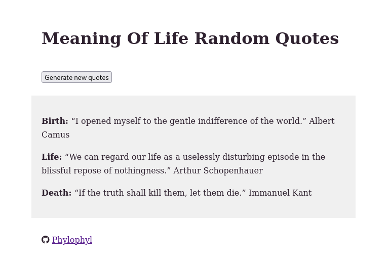

# MixedMessages

1. [Goal and features](#goal-and-features)
2. [Technology](#technology)
3. [How to run the script](#how-to-run-the-script)
3. [Screenshot](#screenshot)

## Goal and features

Project from the Code Academy Full-stack developper'path.  

Quotes generator. The generator show 3 random quotes (birth, life, death) on a web page. New quotes can be generated with a click on a button. Each of the three categories have 10 quotes, for a total of 30 quotes stored in the js script.  

Quotes are taken from the website [Goodreads](https://www.goodreads.com
).

## Technology

Javascript.  
Html CSS.  
Fontawesome.  

## How to run the script

Open with your web browser the following file at the root of the repository:

	index.html
	
 
	
## Screenshot

 